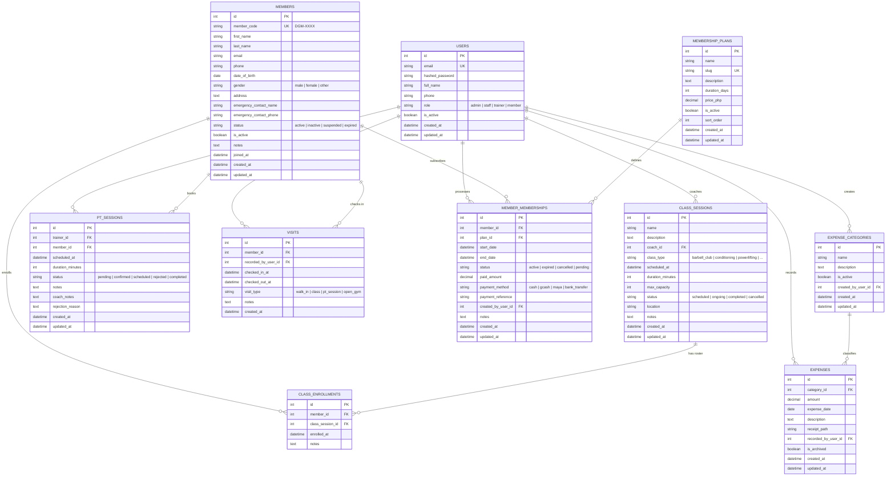

# DATABASE_SCHEMA.md — THE DGYM Database Architecture & Entity Relationship

> **Project:** THE DGYM — Rosario, Batangas Gym Management & AI Analytics Platform  
> **Database Engine:** SQLite (Local Dev) / PostgreSQL (Production Async Engine via SQLAlchemy 2.0)  
> **Schema Version:** 1.2.0 (Phase 0–5 + Finance Module)  
> **Last Updated:** October 2026  

---

## 1. Executive Summary

The database architecture for **THE DGYM** is designed using 3rd Normal Form (3NF) principles to support high-throughput front-desk operations, role-based access control (RBAC), subscription lifecycle management, attendance tracking, scheduling, and fiscal accounting.

### Core Functional Modules:
1. **Identity & Access Management (IAM):** Role-segregated accounts (`admin`, `staff`, `trainer`, `member`).
2. **Member & Subscriptions:** Member profiles (`DGM-XXXX` format), tier catalog, and payment transaction logs.
3. **Gym Operations & Attendance:** Dwell time check-in/out records, group classes with capacity constraints, and 1-on-1 personal training requests.
4. **Finance & Overhead Accounting:** Operating expense categorization and cash disbursement tracking for gym profitability analysis.

---

## 2. Entity Relationship Diagram (ERD)

---

## 3. Data Dictionary & Table Specifications

### 3.1. `users` Table
Stores user accounts for authentication and role-based permissions across the application.

| Column | Data Type | Constraints | Description |
|---|---|---|---|
| `id` | `INTEGER` | `PRIMARY KEY`, Auto Increment | Unique internal system user ID |
| `email` | `VARCHAR(255)` | `NOT NULL`, `UNIQUE`, Indexed | User's login email address |
| `hashed_password` | `VARCHAR(255)` | `NOT NULL` | Argon2id encrypted password hash |
| `full_name` | `VARCHAR(255)` | `NOT NULL` | Full display name |
| `phone` | `VARCHAR(50)` | `NULL` | Contact phone number |
| `role` | `VARCHAR(20)` | `NOT NULL` | Role enum: `'admin'`, `'staff'`, `'trainer'`, `'member'` |
| `is_active` | `BOOLEAN` | `NOT NULL`, Default `TRUE` | Account active state |
| `created_at` | `DATETIME` | `NOT NULL` | Account registration timestamp |
| `updated_at` | `DATETIME` | `NOT NULL` | Last profile update timestamp |

---

### 3.2. `members` Table
Stores the primary demographic and athlete profile for gym members.

| Column | Data Type | Constraints | Description |
|---|---|---|---|
| `id` | `INTEGER` | `PRIMARY KEY`, Auto Increment | Internal unique ID |
| `member_code` | `VARCHAR(20)` | `NOT NULL`, `UNIQUE`, Indexed | Human-readable identifier (e.g., `DGM-0001`) |
| `first_name` | `VARCHAR(100)` | `NOT NULL` | Member's given name |
| `last_name` | `VARCHAR(100)` | `NOT NULL` | Member's family name |
| `email` | `VARCHAR(255)` | `NULL` | Member contact email |
| `phone` | `VARCHAR(50)` | `NULL` | Member mobile number |
| `date_of_birth` | `DATE` | `NULL` | Birth date for age analytics |
| `gender` | `VARCHAR(20)` | `NULL` | `'male'`, `'female'`, `'other'`, `'prefer_not_to_say'` |
| `address` | `TEXT` | `NULL` | Residential address |
| `emergency_contact_name` | `VARCHAR(255)` | `NULL` | In-case-of-emergency contact name |
| `emergency_contact_phone` | `VARCHAR(50)` | `NULL` | Emergency contact telephone |
| `status` | `VARCHAR(20)` | `NOT NULL`, Default `'active'` | Status enum: `'active'`, `'inactive'`, `'suspended'`, `'expired'` |
| `is_active` | `BOOLEAN` | `NOT NULL`, Default `TRUE` | Active membership flag |
| `notes` | `TEXT` | `NULL` | Health conditions, goals, or staff remarks |
| `joined_at` | `DATETIME` | `NOT NULL` | Member registration date |
| `created_at` | `DATETIME` | `NOT NULL` | Record creation timestamp |
| `updated_at` | `DATETIME` | `NOT NULL` | Last update timestamp |

---

### 3.3. `membership_plans` Table
Defines available gym membership packages, duration, and baseline pricing.

| Column | Data Type | Constraints | Description |
|---|---|---|---|
| `id` | `INTEGER` | `PRIMARY KEY`, Auto Increment | Internal unique plan ID |
| `name` | `VARCHAR(100)` | `NOT NULL` | Plan display name (e.g. `'Monthly Pass'`) |
| `slug` | `VARCHAR(100)` | `NOT NULL`, `UNIQUE`, Indexed | URL/identifier slug (e.g. `'monthly-pass'`) |
| `description` | `TEXT` | `NULL` | Plan benefits and inclusions |
| `duration_days` | `INTEGER` | `NOT NULL` | Validity length in days (e.g. 1, 30, 90, 365) |
| `price_php` | `NUMERIC(10, 2)` | `NOT NULL` | Baseline price in Philippine Pesos (PHP) |
| `is_active` | `BOOLEAN` | `NOT NULL`, Default `TRUE` | Plan availability for enrollment |
| `sort_order` | `INTEGER` | `NOT NULL`, Default `0` | UI display ordering sequence |
| `created_at` | `DATETIME` | `NOT NULL` | Record creation timestamp |
| `updated_at` | `DATETIME` | `NOT NULL` | Last update timestamp |

---

### 3.4. `member_memberships` Table
Represents active subscriptions, renewal histories, and financial transactions per member.

| Column | Data Type | Constraints | Description |
|---|---|---|---|
| `id` | `INTEGER` | `PRIMARY KEY`, Auto Increment | Internal subscription ID |
| `member_id` | `INTEGER` | `NOT NULL`, `FK -> members(id)` | Associated gym member |
| `plan_id` | `INTEGER` | `NOT NULL`, `FK -> membership_plans(id)` | Purchased plan tier |
| `start_date` | `DATETIME` | `NOT NULL` | Membership validity start date |
| `end_date` | `DATETIME` | `NOT NULL` | Membership expiration date |
| `status` | `VARCHAR(20)` | `NOT NULL` | `'active'`, `'expired'`, `'cancelled'`, `'pending'` |
| `paid_amount` | `NUMERIC(10, 2)` | `NULL` | Actual amount paid in PHP |
| `payment_method` | `VARCHAR(20)` | `NULL` | `'cash'`, `'gcash'`, `'maya'`, `'bank_transfer'`, `'other'` |
| `payment_reference` | `VARCHAR(100)` | `NULL` | Transaction ID or receipt number |
| `created_by_user_id`| `INTEGER` | `NULL`, `FK -> users(id)` | Staff who recorded the transaction |
| `notes` | `TEXT` | `NULL` | Promotional notes or discounts applied |
| `created_at` | `DATETIME` | `NOT NULL` | Transaction recorded timestamp |
| `updated_at` | `DATETIME` | `NOT NULL` | Subscription updated timestamp |

---

### 3.5. `visits` Table
Front-desk physical entry and exit audit log, calculating dwell time and peak hours.

| Column | Data Type | Constraints | Description |
|---|---|---|---|
| `id` | `INTEGER` | `PRIMARY KEY`, Auto Increment | Unique visit record ID |
| `member_id` | `INTEGER` | `NOT NULL`, `FK -> members(id)` | Checked-in member |
| `recorded_by_user_id`| `INTEGER`| `NULL`, `FK -> users(id)` | Front-desk staff on duty |
| `checked_in_at` | `DATETIME` | `NOT NULL`, Indexed | Time of gym entry |
| `checked_out_at` | `DATETIME` | `NULL` | Time of gym departure |
| `visit_type` | `VARCHAR(20)` | `NOT NULL` | `'walk_in'`, `'class'`, `'pt_session'`, `'open_gym'` |
| `notes` | `TEXT` | `NULL` | Desk notes (e.g. locker #, gear loaned) |
| `created_at` | `DATETIME` | `NOT NULL` | Log creation timestamp |

---

### 3.6. `class_sessions` Table
Group fitness schedule, coaching assignments, and session capacities.

| Column | Data Type | Constraints | Description |
|---|---|---|---|
| `id` | `INTEGER` | `PRIMARY KEY`, Auto Increment | Unique class session ID |
| `name` | `VARCHAR(150)` | `NOT NULL` | Class title (e.g. `'Barbell Club - Morning'`) |
| `description` | `TEXT` | `NULL` | Session curriculum or objectives |
| `coach_id` | `INTEGER` | `NULL`, `FK -> users(id)` | Assigned instructor |
| `class_type` | `VARCHAR(20)` | `NOT NULL` | `'barbell_club'`, `'conditioning'`, `'powerlifting'`, `'strength'`, `'hiit'`, `'open_gym'`, `'other'` |
| `scheduled_at` | `DATETIME` | `NOT NULL`, Indexed | Class date and time |
| `duration_minutes` | `INTEGER` | `NOT NULL`, Default `60` | Class duration in minutes |
| `max_capacity` | `INTEGER` | `NOT NULL`, Default `15` | Maximum allowed participants |
| `status` | `VARCHAR(20)` | `NOT NULL` | `'scheduled'`, `'ongoing'`, `'completed'`, `'cancelled'` |
| `location` | `VARCHAR(100)`| `NULL` | Facility zone (e.g. `'Main Turf'`, `'Platform 1'`) |
| `notes` | `TEXT` | `NULL` | Equipment needed or prerequisites |
| `created_at` | `DATETIME` | `NOT NULL` | Record creation timestamp |
| `updated_at` | `DATETIME` | `NOT NULL` | Last update timestamp |

---

### 3.7. `class_enrollments` Table
Junction roster linking members to scheduled group fitness classes.

| Column | Data Type | Constraints | Description |
|---|---|---|---|
| `id` | `INTEGER` | `PRIMARY KEY`, Auto Increment | Unique enrollment ID |
| `member_id` | `INTEGER` | `NOT NULL`, `FK -> members(id)` | Registered member |
| `class_session_id` | `INTEGER` | `NOT NULL`, `FK -> class_sessions(id)` | Associated class session |
| `enrolled_at` | `DATETIME` | `NOT NULL` | Registration timestamp |
| `notes` | `TEXT` | `NULL` | Attendee notes or gear requests |

---

### 3.8. `pt_sessions` Table
1-on-1 personal training requests, coach approvals, and workout completion logs.

| Column | Data Type | Constraints | Description |
|---|---|---|---|
| `id` | `INTEGER` | `PRIMARY KEY`, Auto Increment | Unique PT session ID |
| `trainer_id` | `INTEGER` | `NULL`, `FK -> users(id)` | Assigned trainer / instructor |
| `member_id` | `INTEGER` | `NOT NULL`, `FK -> members(id)` | Trained member |
| `scheduled_at` | `DATETIME` | `NOT NULL`, Indexed | Appointment start time |
| `duration_minutes` | `INTEGER` | `NOT NULL`, Default `60` | Session duration |
| `status` | `VARCHAR(20)` | `NOT NULL` | `'pending'`, `'confirmed'`, `'scheduled'`, `'rejected'`, `'completed'`, `'cancelled'`, `'no_show'` |
| `notes` | `TEXT` | `NULL` | Member fitness goals or request notes |
| `coach_notes` | `TEXT` | `NULL` | Private coaching programming remarks |
| `rejection_reason` | `TEXT` | `NULL` | Explanation if coach declines request |
| `created_at` | `DATETIME` | `NOT NULL` | Booking creation timestamp |
| `updated_at` | `DATETIME` | `NOT NULL` | Status update timestamp |

---

### 3.9. `expense_categories` Table
Categorization taxonomy for recurring overhead and operational gym expenditures.

| Column | Data Type | Constraints | Description |
|---|---|---|---|
| `id` | `INTEGER` | `PRIMARY KEY`, Auto Increment | Unique category ID |
| `name` | `VARCHAR(100)` | `NOT NULL`, Indexed | Category name (e.g. `'Equipment'`, `'Utilities'`) |
| `description` | `TEXT` | `NULL` | Category explanation |
| `is_active` | `BOOLEAN` | `NOT NULL`, Default `TRUE` | Category active flag |
| `created_by_user_id`| `INTEGER`| `NULL`, `FK -> users(id)` | Admin who created category |
| `created_at` | `DATETIME` | `NOT NULL` | Creation timestamp |
| `updated_at` | `DATETIME` | `NOT NULL` | Last update timestamp |

---

### 3.10. `expenses` Table
Ledger of expenses, bills, maintenance, and equipment purchases.

| Column | Data Type | Constraints | Description |
|---|---|---|---|
| `id` | `INTEGER` | `PRIMARY KEY`, Auto Increment | Unique expense record ID |
| `category_id` | `INTEGER` | `NOT NULL`, `FK -> expense_categories(id)` | Linked expense category |
| `amount` | `NUMERIC(12, 2)`| `NOT NULL` | Monetary amount spent in PHP |
| `expense_date` | `DATE` | `NOT NULL`, Indexed | Date of invoice/disbursement |
| `description` | `TEXT` | `NOT NULL` | Line-item description / payee |
| `receipt_path` | `VARCHAR(500)`| `NULL` | Receipt file upload storage path |
| `recorded_by_user_id`| `INTEGER`| `NULL`, `FK -> users(id)` | Admin user logging the expense |
| `is_archived` | `BOOLEAN` | `NOT NULL`, Default `FALSE` | Soft-delete / archive flag |
| `created_at` | `DATETIME` | `NOT NULL` | Record creation timestamp |
| `updated_at` | `DATETIME` | `NOT NULL` | Last update timestamp |

---

## 4. Key Relationships & Cardinality Summary

1. **One-to-Many (`1:N`) Users to Operations:**
   - One `User` (Trainer) can lead **many** `class_sessions`.
   - One `User` (Trainer) can conduct **many** `pt_sessions`.
   - One `User` (Staff) can record **many** `visits`, `member_memberships`, and `expenses`.

2. **One-to-Many (`1:N`) Members to Transactions & Attendance:**
   - One `Member` can hold **many** historical `member_memberships`.
   - One `Member` can log **many** `visits` over their membership tenure.
   - One `Member` can request **many** `pt_sessions`.

3. **Many-to-Many (`M:N`) Members to Classes via Junction:**
   - `members` $\leftrightarrow$ `class_enrollments` $\leftrightarrow$ `class_sessions`.
   - A member can enroll in multiple class sessions; a class session contains many enrolled members.

4. **One-to-Many (`1:N`) Finance Ledger:**
   - One `expense_category` groups **many** `expenses`.
   - Enables monthly aggregation for net profit calculation (`Profit = Membership Revenue - Total Expenses`).

---

## 5. Machine Learning (ML) & Analytics Readability

This schema directly powers the **Phase 6 Member Retention & Churn Prediction Pipeline**:
- **Visit Velocity:** Derived from count of `visits` grouped by `member_id` over 7, 30, and 90-day intervals.
- **Dwell Time:** `strftime('%s', checked_out_at) - strftime('%s', checked_in_at)`.
- **Recency (Days Since Last Check-in):** `julianday('now') - julianday(MAX(checked_in_at))`.
- **Tenure:** `julianday('now') - julianday(joined_at)`.
- **Engagement Breadth:** Ratio of personal training (`pt_sessions`) and classes (`class_enrollments`) attended versus open gym walk-ins.
