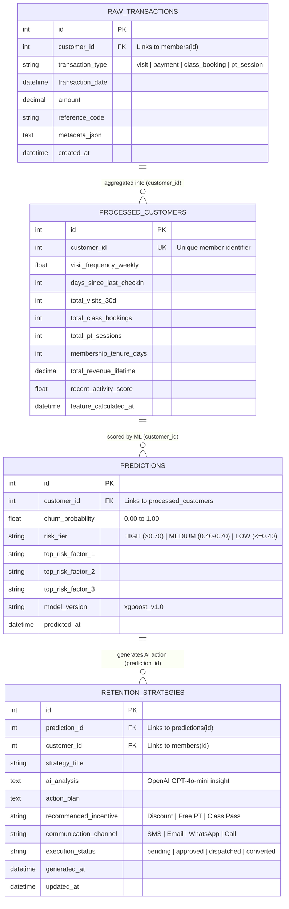

# DATABASE_SCHEMA.md — THE DGYM Full Database Architecture & ERD

> **Project:** THE DGYM — Rosario, Batangas Gym Management & AI Analytics Platform  
> **Database Engine:** PostgreSQL 16 (Production) / SQLite 3 (Local Development via async SQLAlchemy 2.0)  
> **Architecture Compliance:** Fully aligned with `docs/ARCHITECTURE.md` and the System Architectural Diagram.  
> **Last Updated:** October 2026  

---

## 1. System Architecture Alignment

The database architecture for **THE DGYM** consists of two interconnected layers:

```
┌──────────────────────────────────────────────────────────────────────────────────────────────────────┐
│                                 THE DGYM UNIFIED DATABASE ARCHITECTURE                               │
│                                                                                                      │
│  [ LAYER 1: OPERATIONAL GYM MANAGEMENT (OLTP - Phases 3–5) ]                                        │
│  users ─── members ─── membership_plans ─── member_memberships ─── visits ─── classes ─── expenses   │
│                                           │                                                          │
│                                           ▼ ETL & Ingestion                                          │
│  [ LAYER 2: DATA INTELLIGENCE & AI PIPELINE (OLAP / ML - Phases 6–7) ]                              │
│                                                                                                      │
│       ┌──────────────────┐    customer_id    ┌───────────────────────┐                               │
│       │ raw_transactions │ ────────────────► │  processed_customers  │                               │
│       └──────────────────┘                   └───────────────────────┘                               │
│                                                          │                                           │
│                                              customer_id │                                           │
│                                                          ▼                                           │
│       ┌──────────────────────┐  prediction_id ┌──────────────────────┐                               │
│       │ retention_strategies │ ◄───────────── │     predictions      │                               │
│       └──────────────────────┘                └──────────────────────┘                               │
│                                                                                                      │
└──────────────────────────────────────────────────────────────────────────────────────────────────────┘
```

1. **Layer 1: Operational Management Subsystem (Live Operations)**
   - Powers the web app, staff dashboard, desk check-in, group classes, 1-on-1 coach booking, and accounting ledger.
   - Tables: `users`, `members`, `membership_plans`, `member_memberships`, `visits`, `class_sessions`, `class_enrollments`, `pt_sessions`, `expense_categories`, `expenses`.

2. **Layer 2: Data Intelligence & AI Retention Subsystem (Architectural Diagram Focus)**
   - Powers the machine learning feature store, XGBoost churn classification, and OpenAI GPT-4o-mini personalized retention generation.
   - Tables: `raw_transactions`, `processed_customers`, `predictions`, `retention_strategies`.

---

## 2. Entity Relationship Diagram (ERD) — Data Intelligence & AI Subsystem

Directly models the relationship specified in the **Database Architecture Diagram**:



---

## 3. Data Dictionary: Data Intelligence & AI Tables

### 3.1. `raw_transactions` Table
Stores raw and ingested operational records (visits, fees, payments, bookings) before feature transformations.

| Column | Data Type | Constraints | Description |
|---|---|---|---|
| `id` | `INTEGER` | `PRIMARY KEY`, Auto Increment | Unique transaction record ID |
| `customer_id` | `INTEGER` | `NOT NULL`, `FK -> members(id)`, Indexed | Associated member ID |
| `transaction_type` | `VARCHAR(50)` | `NOT NULL` | `'visit'`, `'payment'`, `'class_booking'`, `'pt_session'` |
| `transaction_date` | `DATETIME` | `NOT NULL`, Indexed | Timestamp of the event |
| `amount` | `NUMERIC(10, 2)` | `NULL`, Default `0.00` | Monetary value (for payments/purchases) |
| `reference_code` | `VARCHAR(100)` | `NULL` | External transaction or session reference |
| `metadata_json` | `TEXT` | `NULL` | Raw JSON payload / attributes |
| `created_at` | `DATETIME` | `NOT NULL` | Ingestion timestamp |

---

### 3.2. `processed_customers` Table
The ML Feature Store containing aggregated, normalized behavioral indicators engineered from raw transactions.

| Column | Data Type | Constraints | Description |
|---|---|---|---|
| `id` | `INTEGER` | `PRIMARY KEY`, Auto Increment | Feature vector row ID |
| `customer_id` | `INTEGER` | `NOT NULL`, `UNIQUE`, Indexed | Member ID identifier |
| `visit_frequency_weekly` | `FLOAT` | `NOT NULL`, Default `0.0` | Average check-ins per week (last 4 weeks) |
| `days_since_last_checkin`| `INTEGER` | `NOT NULL` | Recency indicator (days since last entry) |
| `total_visits_30d` | `INTEGER` | `NOT NULL`, Default `0` | Check-in volume in past 30 days |
| `total_class_bookings` | `INTEGER` | `NOT NULL`, Default `0` | Lifetime group class attendance count |
| `total_pt_sessions` | `INTEGER` | `NOT NULL`, Default `0` | Lifetime 1-on-1 PT sessions count |
| `membership_tenure_days`| `INTEGER` | `NOT NULL` | Days since initial member registration |
| `total_revenue_lifetime`| `NUMERIC(12, 2)` | `NOT NULL` | Total PHP spent on memberships and passes |
| `recent_activity_score` | `FLOAT` | `NOT NULL` | Weighted momentum index (0.0 to 1.0) |
| `feature_calculated_at` | `DATETIME` | `NOT NULL` | Feature calculation timestamp |

---

### 3.3. `predictions` Table
Stores inference outputs generated by the XGBoost Churn Classification pipeline.

| Column | Data Type | Constraints | Description |
|---|---|---|---|
| `id` | `INTEGER` | `PRIMARY KEY`, Auto Increment | Prediction ID |
| `customer_id` | `INTEGER` | `NOT NULL`, `FK -> processed_customers(customer_id)`, Indexed | Evaluated customer |
| `churn_probability` | `FLOAT` | `NOT NULL` | Model confidence score between `0.00` and `1.00` |
| `risk_tier` | `VARCHAR(20)` | `NOT NULL`, Indexed | `'HIGH'` (>0.70), `'MEDIUM'` (0.40–0.70), `'LOW'` (≤0.40) |
| `top_risk_factor_1` | `VARCHAR(150)` | `NULL` | Primary churn indicator (e.g., `'Zero visits in 21 days'`) |
| `top_risk_factor_2` | `VARCHAR(150)` | `NULL` | Secondary risk factor (e.g., `'Expiring within 7 days'`) |
| `top_risk_factor_3` | `VARCHAR(150)` | `NULL` | Tertiary risk factor (e.g., `'Declining weekly attendance'`) |
| `model_version` | `VARCHAR(50)` | `NOT NULL` | ML artifact version (e.g. `'xgboost_v1.0'`) |
| `predicted_at` | `DATETIME` | `NOT NULL` | Prediction generation timestamp |

---

### 3.4. `retention_strategies` Table
Stores personalized member retention campaigns generated by OpenAI GPT-4o-mini based on prediction risk factors.

| Column | Data Type | Constraints | Description |
|---|---|---|---|
| `id` | `INTEGER` | `PRIMARY KEY`, Auto Increment | Strategy ID |
| `prediction_id` | `INTEGER` | `NOT NULL`, `FK -> predictions(id)`, Indexed | Linked churn prediction |
| `customer_id` | `INTEGER` | `NOT NULL`, `FK -> members(id)`, Indexed | Target member |
| `strategy_title` | `VARCHAR(200)` | `NOT NULL` | Campaign title (e.g. `'VIP Comeback Offer'`) |
| `ai_analysis` | `TEXT` | `NOT NULL` | GPT-4o-mini churn root-cause synthesis |
| `action_plan` | `TEXT` | `NOT NULL` | Step-by-step coaching/staff engagement playbook |
| `recommended_incentive`| `VARCHAR(150)` | `NULL` | Specific discount, free PT, or perk offered |
| `communication_channel`| `VARCHAR(50)` | `NOT NULL` | `'SMS'`, `'Email'`, `'WhatsApp'`, `'In-Person'` |
| `execution_status` | `VARCHAR(20)` | `NOT NULL`, Default `'pending'` | `'pending'`, `'approved'`, `'dispatched'`, `'converted'` |
| `generated_at` | `DATETIME` | `NOT NULL` | AI strategy generation timestamp |
| `updated_at` | `DATETIME` | `NOT NULL` | Campaign status update timestamp |

---

## 4. Operational Tables (OLTP Subsystem — Live Gym Operations)

These tables run the day-to-day gym workflows:

1. **`users`**: System login accounts with Argon2id passwords and RBAC roles (`admin`, `staff`, `trainer`, `member`).
2. **`members`**: Member directory with unique codes (`DGM-XXXX`), demographics, contact, and health notes.
3. **`membership_plans`**: Plan pricing tiers (Day Pass, Monthly, Quarterly, Annual, Student).
4. **`member_memberships`**: Active subscription assignments and payment receipts.
5. **`visits`**: Front-desk check-in/out logs with dwell time calculations.
6. **`class_sessions`**: Group class schedules (Powerlifting, Barbell Club, Conditioning) with capacity limits.
7. **`class_enrollments`**: Member registration junction roster per class session.
8. **`pt_sessions`**: 1-on-1 personal training requests, coach approvals, and workout programming logs.
9. **`expense_categories`**: Financial taxonomy for overhead costs (Equipment, Utilities, Maintenance, Rent).
10. **`expenses`**: Cash disbursement ledger tracking gym expenditures.

---

## 5. Summary for Professor Presentation

Kung tatanungin ka ng Prof kung paano nagtutugma ang dalawang parte:

> **"Sir/Ma'am, our system is divided into two synchronized layers:**
> 1. **Operational Layer (OLTP):** Nangangalap ng live gym records — check-ins ng members (`visits`), class enrollments, subscriptions, at trainer sessions.
> 2. **Intelligence & AI Layer (OLAP):** Ang nasa architectural diagram natin kung saan ang raw activity records (`raw_transactions`) ay kinukuha ng data pipeline, ginagawang customer behavioral features (`processed_customers`), pinapadaan sa **XGBoost Machine Learning model** para mag-produce ng churn predictions (`predictions`), at kung high-risk ang member, gumagawa si **OpenAI GPT-4o-mini** ng automated personalized retention strategy (`retention_strategies`)."
